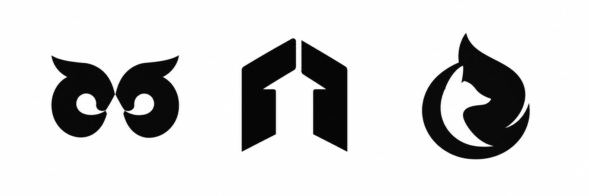
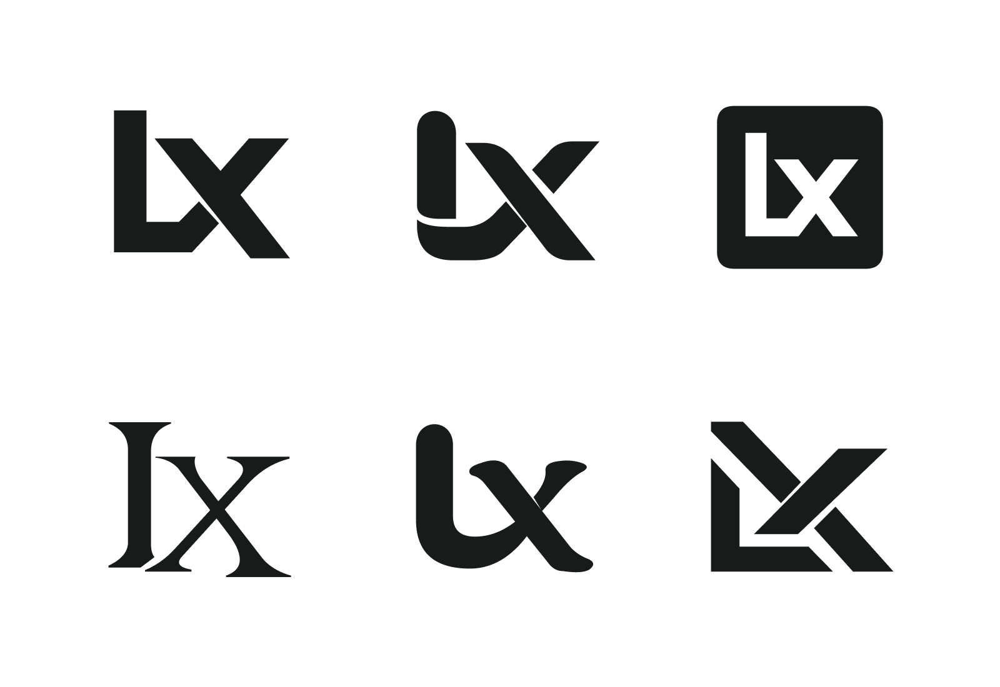

# Logo Concept Lab

一个面向 Logo 创意发散与字母图形设计的 AI Agent skill。将参考学习、业务语义、共形／负形构思、视觉筛选和 Figma 交付连接起来。

An AI Agent skill for logo ideation and letter-monogram design. It connects reference learning, business meaning, shared-contour and negative-space construction, visual evaluation, and Figma delivery.

适合：新品牌 Logo 构思、参考视频方法拆解、两字母 Monogram、多方向视觉测试，以及“设计感不足”后的重新发散。

Use it for new brand concepts, learning methods from reference videos, two-letter monograms, multi-direction visual tests, and developing stronger alternatives after a design-quality critique.

## 核心能力 / Capabilities

- 从参考中提取构形方法，而不是复制成品。
- 用共用轮廓、负空间、局部替换与笔画重组建立双重含义。
- 支持指定字母的纯图形测试，尊重“不加字标／不展示文字”的要求。
- 用黑白轮廓、光学平衡和缩小识别筛选，而非依赖样机包装。
- 支持 Figma 可编辑矢量交付，并要求回读与渲染验证。

- Extract construction methods from references rather than copying finished marks.
- Build double meanings through shared contours, negative space, local substitution, and stroke recombination.
- Support specified-letter symbol tests and respect requests for no wordmarks or extra text.
- Evaluate monochrome silhouettes, optical balance, and small-size recognition instead of relying on mockup presentation.
- Deliver editable vectors in Figma, with read-back and render verification.

## 安装到 Codex / Install in Codex

将此仓库下载到本地，把含有 `SKILL.md` 的目录复制为：

Download the repository and copy the directory containing `SKILL.md` to:

```text
~/.codex/skills/logo-concept-lab/SKILL.md
```

如果设置了自定义 `CODEX_HOME`，使用其下的 `skills/logo-concept-lab` 目录。已有同名 skill 时先比较内容，再决定替换。

If you use a custom `CODEX_HOME`, place it in `skills/logo-concept-lab` under that directory. If a skill with this name already exists, compare its contents before replacing it.

也可以直接克隆到尚不存在的目标目录：

Alternatively, clone directly into a destination that does not already exist:

```sh
git clone https://github.com/AIGC-Xavier/logo-concept-skill.git ~/.codex/skills/logo-concept-lab
```

在支持本地 `SKILL.md` 的其他 Agent 中，按相应产品的技能目录约定安装。

For other agents that support local `SKILL.md` files, follow that product’s skill-directory conventions.

## 使用示例 / Example prompts

```text
使用 $logo-concept-lab，根据品牌官网与这些参考，为品牌做一轮 Logo 构思。
重点找共用轮廓和负形关系，把值得保留的方向放入指定 Figma 文件。
```

```text
Use $logo-concept-lab to develop logo concepts from the brand website and these references.
Focus on shared contours and negative space, and place the strongest directions in the specified Figma file.
```

```text
使用 $logo-concept-lab，以 L、X 两个字母做一轮图形测试。
不要另外展示文字、标题或编号；只比较黑白图形。
```

```text
Use $logo-concept-lab to explore symbols built from the letters L and X.
Do not add wordmarks, titles, or numbers; compare only black-and-white symbols.
```

```text
使用 $logo-concept-lab，检查现有方案为什么缺少设计感。
保留已选方向，调整交叉关系和视觉重心，不要重新扩展整套品牌。
```

```text
Use $logo-concept-lab to examine why the current design lacks visual quality.
Preserve the selected direction, refine intersections and optical balance, and do not expand the task into a complete brand system.
```

## 负形与双重含义 / Negative space and double meanings

三个随机虚拟命题，重点比较同一条边界怎样承担两层含义。以下按从左到右阅读。

Three fictional briefs explore how one boundary can carry two meanings. Read the examples from left to right.



| 命题 / Brief | 机制 / Mechanism | 观察与下一步 / Observation and next step |
| --- | --- | --- |
| 表达与知识 / Expression and knowledge | 引号形的眼窝与猫头鹰面部相互组织。Quote-shaped eye spaces organize an owl-like mask. | 猫头鹰识别较强，引号还可进一步明确。The owl reads strongly; the quotation-mark reading could be clearer. |
| 空间与成长 / Space and growth | 门洞两侧的共用边界留下向上箭头。The sides of a doorway share the edges of an upward arrow. | 容易识别，但几何组合较常见，应继续探索独特比例。Easy to recognize, but a familiar geometric combination; explore more distinctive proportions. |
| 灵敏与能量 / Agility and energy | 火焰状外轮廓内部出现狐狸侧脸，共用耳尖、额头与颈部曲线。A flame-like outer contour reveals a fox profile through shared ear, forehead, and neck curves. | 双重含义较完整；缩小时需检查顶部窄缝与尖角。The double reading is more complete; check narrow gaps and points at small sizes. |

这组三款是 AI 辅助位图构思测试，未经用户最终选定，不是可直接交付的矢量标志。案例用于说明方法与取舍，不代表所有方向都应进入最终方案。后续仍需重建路径、调整光学平衡并验证应用尺寸。

These three marks are AI-assisted raster concept tests, not user-approved final selections or production-ready vector logos. They illustrate methods and tradeoffs rather than imply that every direction deserves final selection. Further work should rebuild paths, refine optical balance, and verify application sizes.

## LX 构形测试示例 / LX construction study



示例为探索稿，用于展示构形比较与纯图形排版；不代表已定稿、生产验证或商标近似检索结论。

LX 示例展示六种字母构形：共笔几何、折带连结、负形方章、时装交织、柔性连笔、斜切构造。预览来自已重建矢量的 Figma 测试画板。

The LX example compares six constructions: shared-stroke geometry, folded connections, a negative-space tile, fashion-style interweaving, a soft ligature, and diagonal modules. The preview was exported from a Figma study with rebuilt vector paths.

This exploratory study demonstrates construction comparison and symbol-only presentation. It is not an approved final identity, production validation, or trademark similarity-search result.

## 工具与范围 / Tools and scope

skill 本身是方法指令，不附带 Figma 连接器或图像生成服务。相关工具可用且用户任务需要时再使用；没有 Figma 编辑工具时，应交付本地文件并说明尚未同步。

The skill provides workflow instructions, not a Figma connector or image-generation service. Use those tools only when available and relevant to the request. Without Figma editing tools, deliver local files and clearly state that they have not been synchronized.

仓库发布的是本次工作中整理的方法与测试示例，不包含参考视频、视频截图、客户官网资料或私人 Figma 地址。

The repository contains the methods and test examples developed during this work. It does not include reference videos, video screenshots, client website material, or private Figma links.
