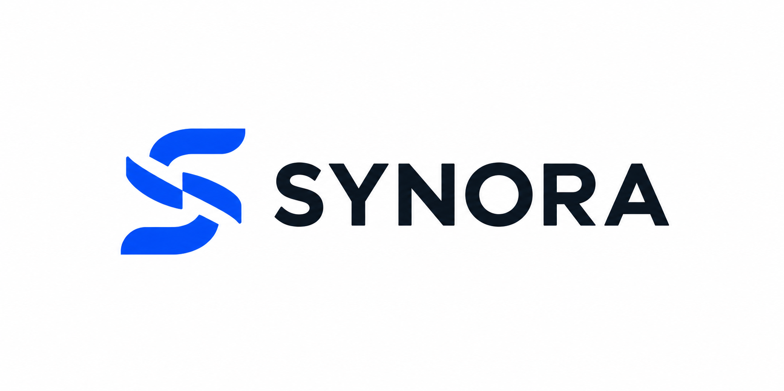
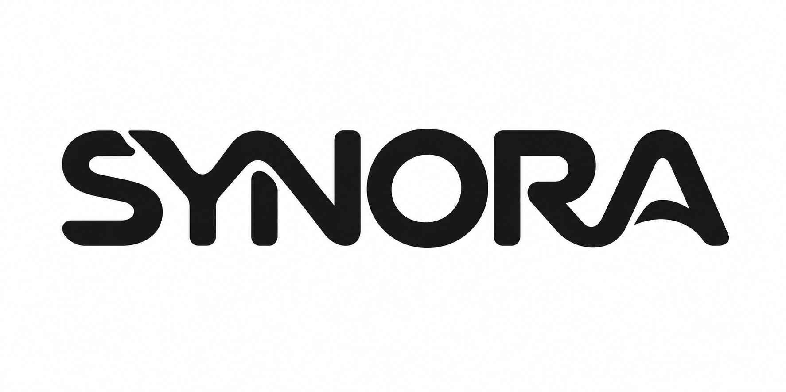
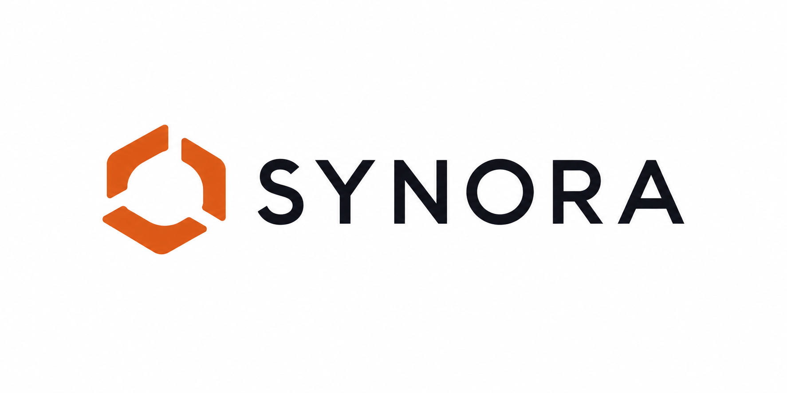
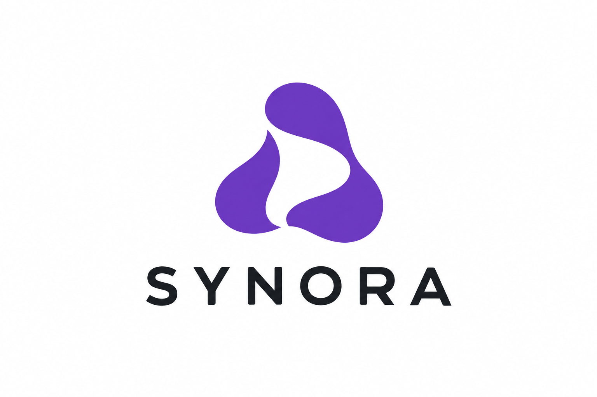
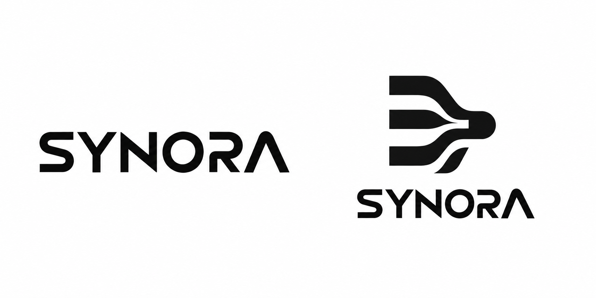
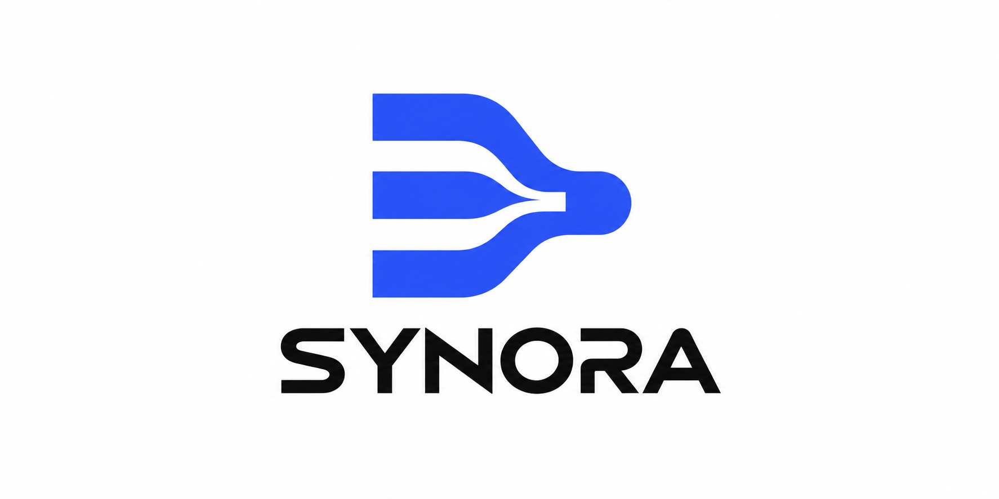

# SYNORA 科技 Logo 版本释义与验证

本轮以虚构的 AI 协作品牌「合序 / SYNORA」作测试：人提出目标，专业 agent 分工协作，输出一致成果；这些是测试假设，不是现实品牌事实。所有图均为内置图像工具生成的位图概念。

## A · 同步字母（蓝色分段 S）

**为什么这样做：**让图形与名称首字母直接关联，同时保留分工协作的关系，适合较理性、明确的科技产品形象。

**结合了什么：**S 的整体走势、分段带状形体，以及彼此呼应的切口。不同片段共同建立一个字母轮廓，意图表达分工后的协调；不是在图形上叠加额外行业图标。

**当前判断：**图标与名称可辨，科技感直接；分段 S 仍有常见科技标志的感觉，中央切口关系可以继续简化。未做商标或相似性检索。

## B · 协作字标（黑色连笔）

**为什么这样做：**让品牌名称本身承担记忆，减少独立图形与字标争夺注意力。

**结合了什么：**YN 与 RA 的连续笔画、圆润转折和统一的粗度。字母既有各自结构，又通过相邻笔画相接，意图把协作关系直接放进名字。

**当前判断：**四版中定制感较明确；YN、RA 的连接需要继续测试读名与小尺寸表现，不能只因连在一起就认定更好。当前更值得继续精修。

## C · 共同工作域（橙色开放框架）

**为什么这样做：**强调共享空间与秩序，适合希望显得稳健、清楚的协作工具。

**结合了什么：**分段围合的框架、开放入口和共同的中央留白。不同部分围绕同一空间组织，意图表现各自独立又共享工作区域。

**当前判断：**组合规整、读名清楚，但围合框架比较常见，品牌独特性偏弱；不作为当前首选。

## D · 柔性智能（紫色有机形）

**为什么这样做：**探索具有亲和感和适应性的科技品牌，减少机械、工业化的观感。

**结合了什么：**饱满与收窄的有机曲线、非对称轮廓，以及中间带 S 形走势的开放负空间。不同体量共同形成一个整体，意图表达能力互补、灵活响应。

**当前判断：**与其余方向的气质差异较明显，有进一步发展为品牌辅助图形的空间；目前仍需验证中央细处和外轮廓在小尺寸下是否清楚。可与 B 一起作为后续选择。

## 首轮探索与定向精修

### 首轮黑白探索

**为什么这样做：**比较名称单独承担识别，以及名称与汇聚图形组合时的表现。

**结合了什么：**同一字标、平行路径与共享出口，意图表达多路工作汇成成果。

**当前判断：**两案更接近组合变化，概念差别不足；图形中的独立碎片、字标中无横杠的 A 和过尖中缝需要修正。

### 蓝色定向精修

**为什么这样做：**保留路径汇聚的关系，集中修正碎片与字形识读问题。

**结合了什么：**简化后的汇聚轮廓、蓝色主标与补回横杠的 A，保持图形与字标的组合方式。

**当前判断：**碎片已删除，A 横杠已补回，中央尖端仍未充分解决。随后扩展为 A–D 四种方向，以比较不同的识别机制。

## 验证说明

测试日期：2026-10-03。共实际生成 6 张图：1 张双方案探索、1 张定向精修、4 张新增方向。全部为虚构品牌的位图概念，未定稿。

两张早期输出做过独立视觉复核；新增 A–D 按实际图像评审。当前更值得继续精修的是 B 的协作字标与 D 的柔性智能，但读名、小尺寸识别、相似性检索、矢量重建和生产验证仍需进一步开展。本轮没有同题受控对照，不能据此证明技能整体效果提升。

图像生成时使用的是 v3；逐版释义规则随后加入，本文补充整理了每版解释。案例用于展示探索、修正与判断过程，不代表后续版本已重新生成或验证这些图像。

[返回技能首页](../../README.md)
